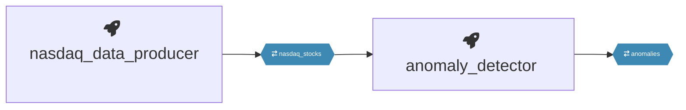
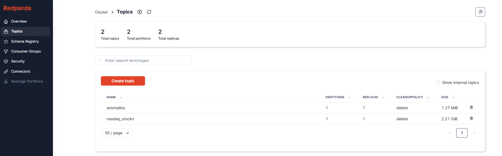
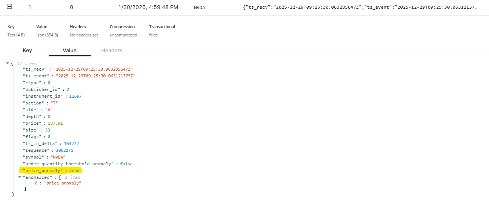

# Stock Market Anomaly Detection

This project performs real-time stock trade anomaly detection using Kafka for streaming. It consists of a data producer that streams historical or live NASDAQ trade data into a Kafka topic, and an anomaly detector that consumes this data to identify unusual trading activity (e.g., high-volume trades) in real time.

## Prerequisites

- Docker
- Quix CLI (https://quix.io/docs/quix-cli/)

## Quick Start

1. Start the pipelines:
	```
	quix pipeline up
	```
2. In one terminal, start the data producer:
	```
	cd nasdaq_data_producer
	python main.py
	```
3. In another terminal, start the anomaly detector:
	```
	cd anomaly_detector
	python main.py
	```

## Architecture
The producer will stream trade data into Kafka, and the detector will process the stream and print detected anomalies.


## How the App looks like...

The first image shows both topics (nasdaq_stocks and anomalies) listed in the Kafka broker.


 The second image shows that an anomaly was detected and output for a transaction.
